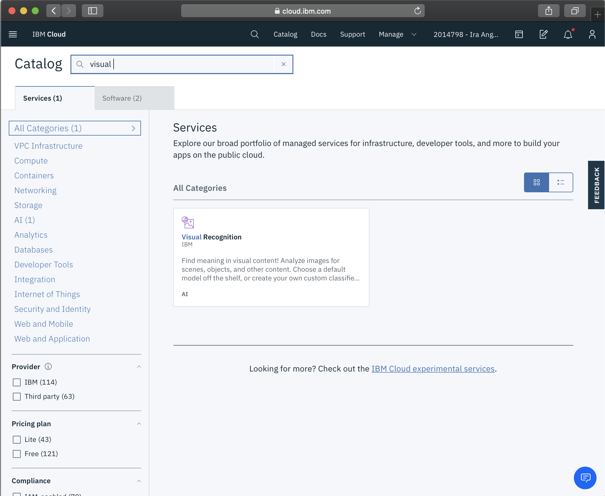
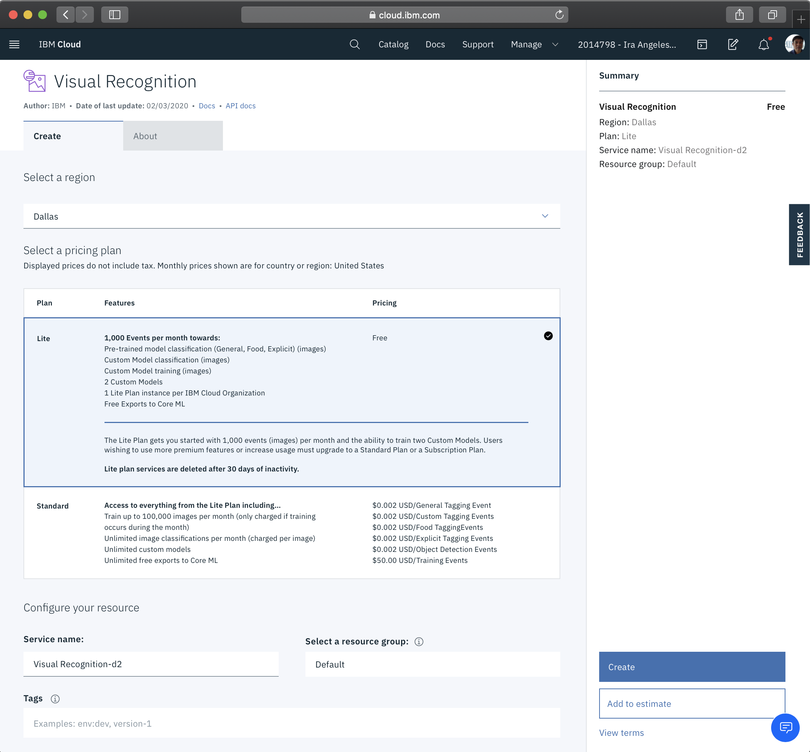
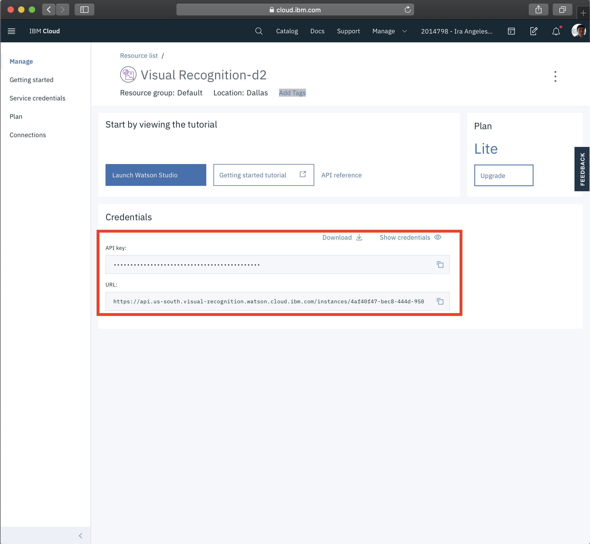

# Create IBM AI Visual Recognition Service

1. Go to Catalog -> AI -> Visual Recognition (or search)

    

 2. Create Visual Recognition Service.  Use default name or preferred name.

    

3. Take note of the credentials

    

