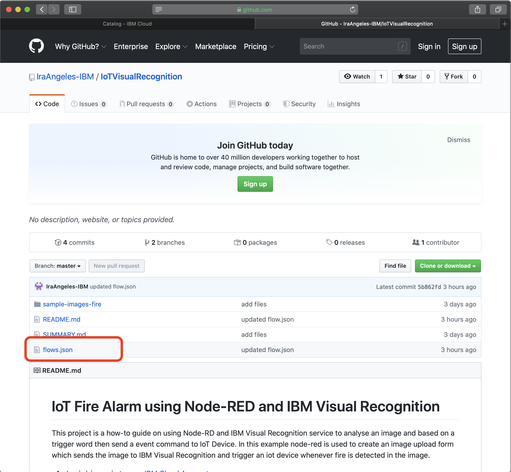
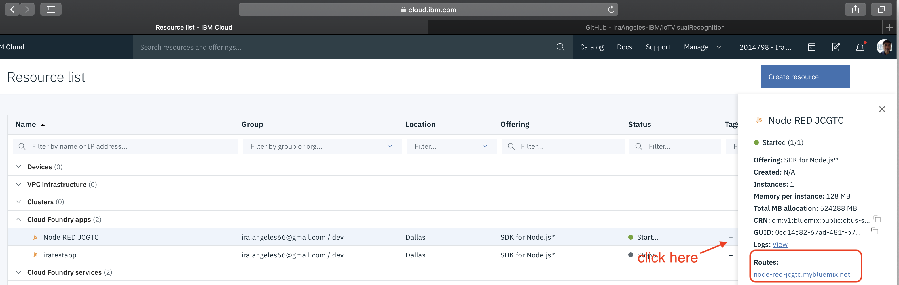
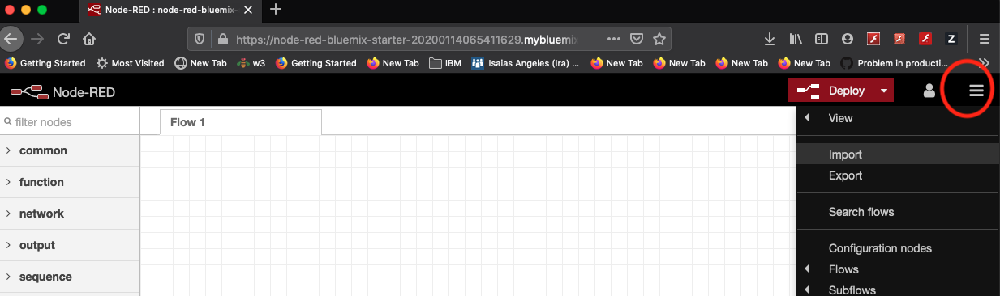
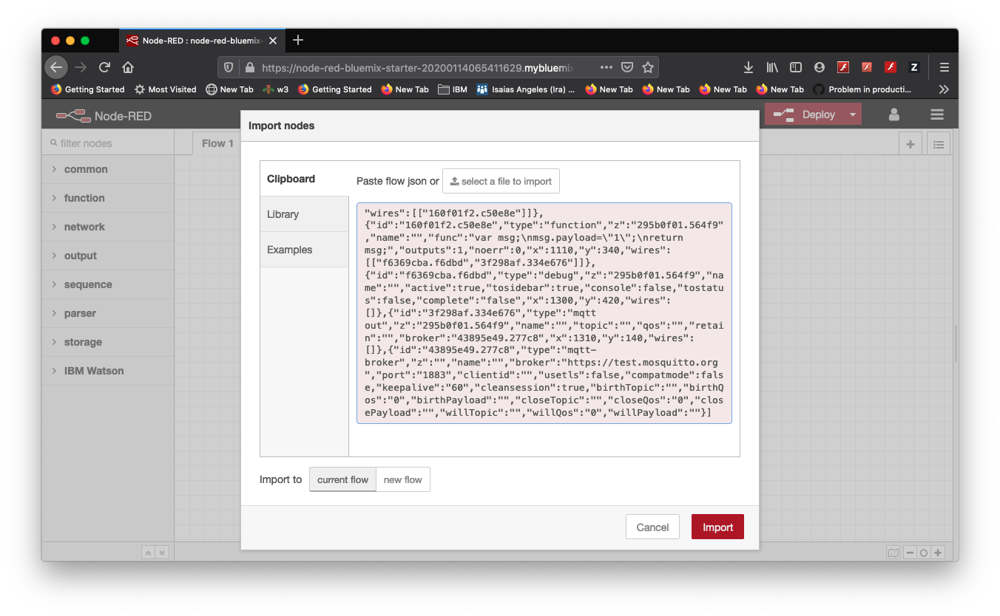
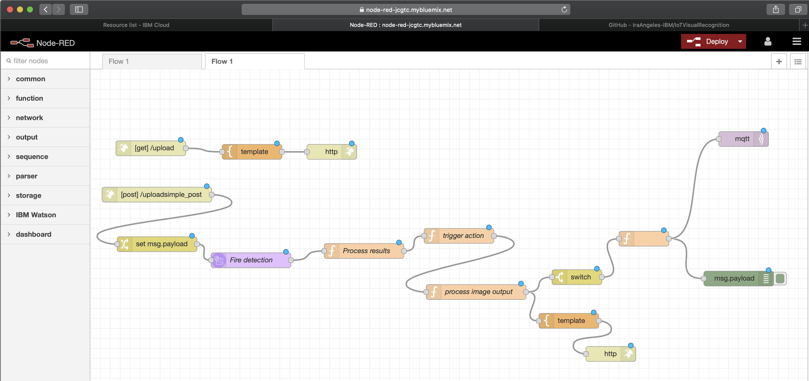

# Import Node-RED flow

1. Open in browser or download [flows.json](https://github.com/IraAngeles-IBM/IoTVisualRecognition)

    

2. Get the url (Routes) to open the Node-RED application from IBM Cloud Resource List

    

3. Go to Node-RED Menu and Import option

    

4. Copy the [flows.json](https://github.com/IraAngeles-IBM/IoTVisualRecognition) contents to the import box and click on Import button

    

5. The following is shown upon successful import

    
