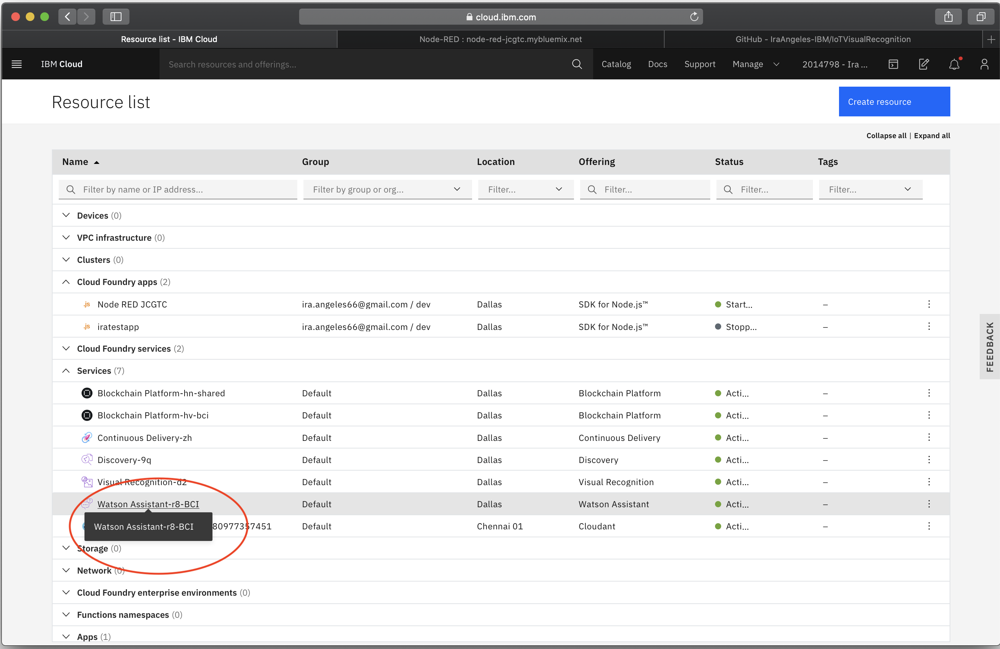
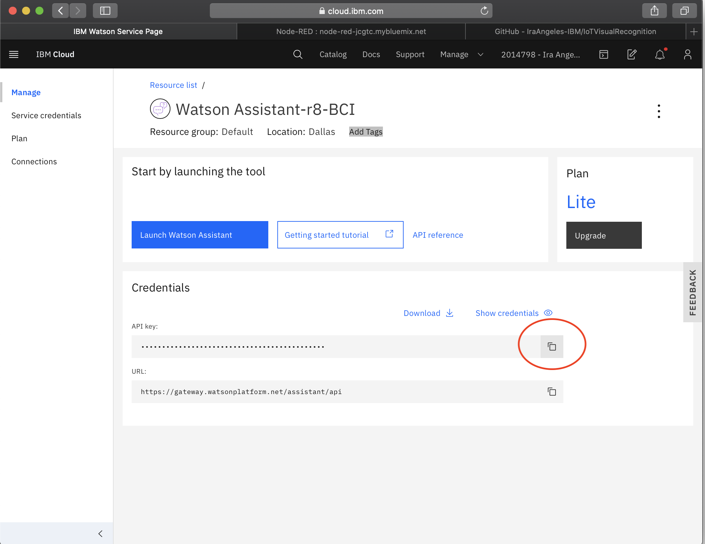
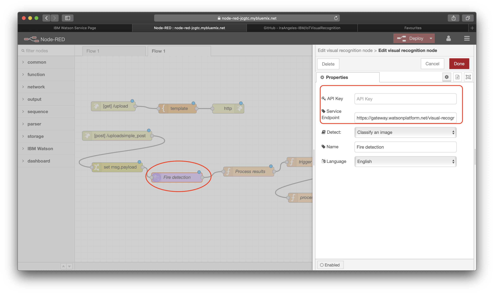

# Update IBM Visual Recognition in Node-RED flow

1. Go to Resource list then select Visual Recognition under Services

    

2. Copy the **API key** and **URL** from Visual Recognition service

    

3. Go to the Node-RED flow then select **Visual Recognition** node, enter the **API key**,  then paste the **URL**. Then click on the **Deploy** button on the upper right side of the navigation bar.

    

