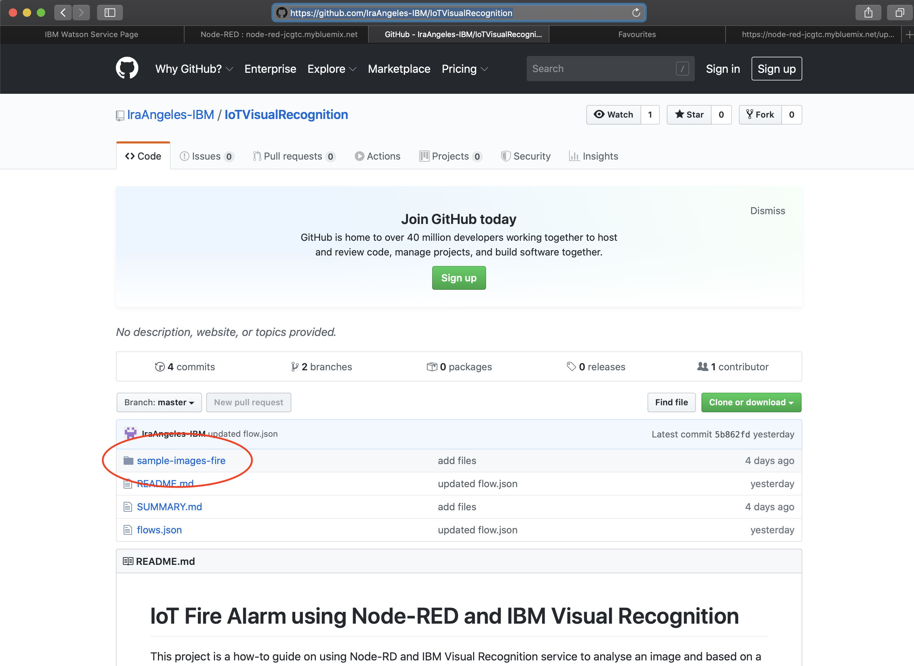
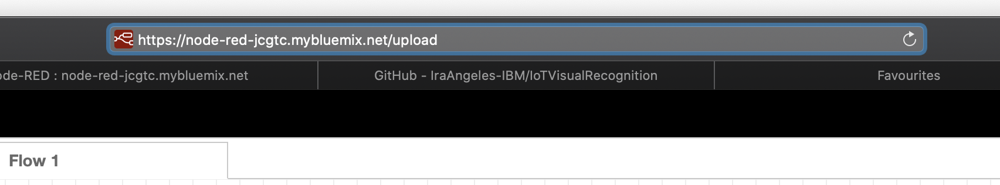
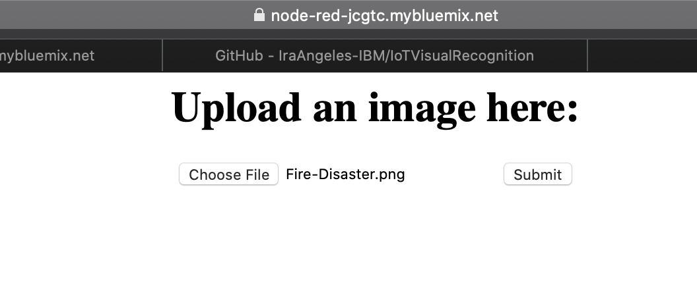
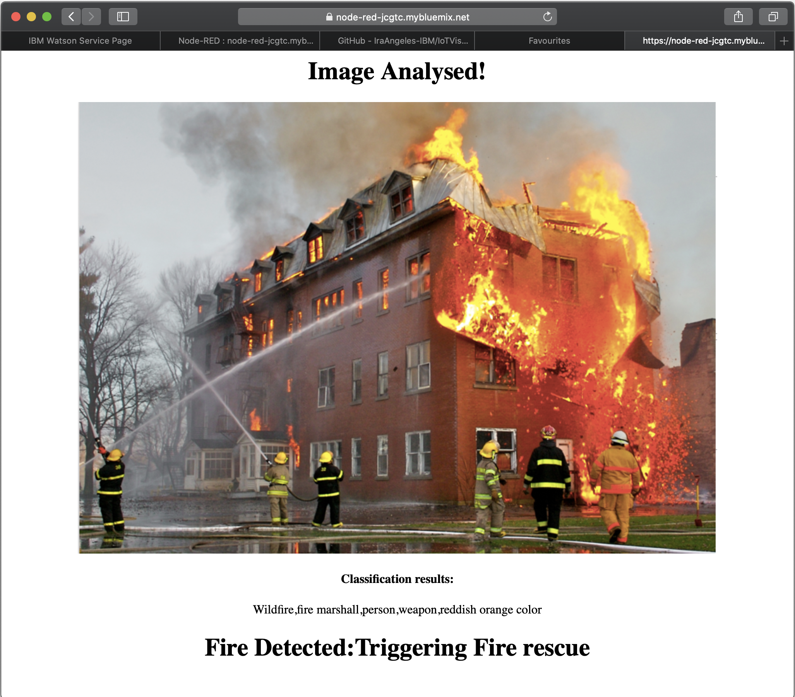

# Upload Image to Node-RED website

1. Download image from [github](https://github.com/IraAngeles-IBM/IoTVisualRecognition) site, sample-images-fire folder.

    

2. Copy the Node-RED URL and append **/upload**, then paste in a new browser window or tab.

    

3. Upload the sample fire image and click **Submit** button

    

4. The following is the result

    

